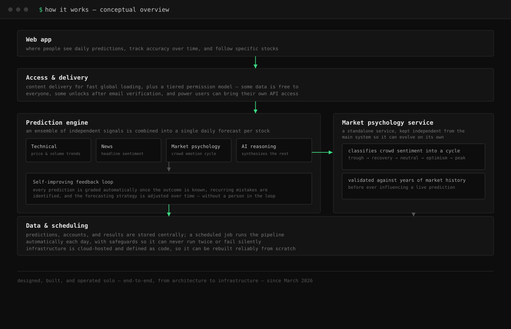

# Hi, I'm Jian 👋

**Backend / Full-Stack Engineer** based in NYC, focused on systems that handle real traffic and AI products that ship.

Previously at **Indeed**, where I built a feature-flag platform serving **20K+ requests/sec at 12ms p95** across 60+ internal apps. Now building **[stockguesser.com](https://stockguesser.com)** solo, end to end.

---

## A note from me

Most stock analysis leans on available data and news, and quietly assumes investors act rationally — that people weigh the numbers in front of them and arrive at sound decisions. I don't think that holds up. Especially today, with so many retail investors trading without any formal training, decisions are often driven by emotion rather than logic.

That gap is what led me to build GuessHowMuch. Drawing on my own interest in psychology, I wanted to model the *irrational* side of investing — for now, that means crowd psychology specifically — and use price prediction as a way to test whether that model actually captures something real about how markets move. It's less about being "right" every time, and more about building a model of the market that matches how I actually believe it behaves.

---

## Featured project — GuessHowMuch

**An AI platform that predicts next-day US stock prices, then grades its own accuracy and improves itself.**

Retail investors mostly go on gut feeling. GuessHowMuch instead combines four independent signals — technical indicators, financial news, market psychology, and an AI model — into a daily prediction for each stock, and is transparent about how often it's actually right.

I designed, built, and deployed the entire thing myself: product decisions, system architecture, the AI/ML pipeline, cloud infrastructure, and the frontend.

**How it runs in production**
- Generates and grades its own predictions daily, without manual intervention
- Reports both price accuracy and directional accuracy transparently — not just whichever number looks better
- Live and self-funded, built and operated solo since March 2026

 

 

a conceptual look at how the system fits together — see below for design details

 

## How it's designed

- **Ensemble prediction design** — rather than relying on one model, independent signals (price/volume trends, news sentiment, market psychology, and AI reasoning) are combined into a single forecast, so no single source of error can dominate the outcome.
- **Self-improving by design** — every prediction is graded automatically once the real outcome is known, recurring mistakes are identified, and the forecasting strategy adjusts over time with no manual retraining step.
- **Market psychology as an independent service** — crowd sentiment is modeled as its own component, separate from the core system, so it can be validated and evolved independently. It was tested against years of historical data before it was trusted with a live prediction.
- **Access designed to grow** — permissions are structured so that new tiers of access (e.g. free vs. verified vs. bring-your-own-key) can be introduced without reworking the system underneath them.
- **Built for unattended, daily operation** — the pipeline runs on a schedule with safeguards against duplicate or silent-failure runs, and the underlying infrastructure is defined as code so it can be reliably rebuilt.

**Built with, by component:**

| Component | Language |
|---|---|
| Web app | TypeScript (React) |
| Core prediction service | TypeScript (Node.js) |
| Market psychology service | Python |
| Infrastructure (defined as code) | HCL (Terraform) |

---

## Tech I work with

---

📫 **Jian.Q@outlook.com** · [linkedin.com/in/jian-qiu](https://linkedin.com/in/jian-qiu/) · [github.com/YoTNT](https://github.com/YoTNT)

